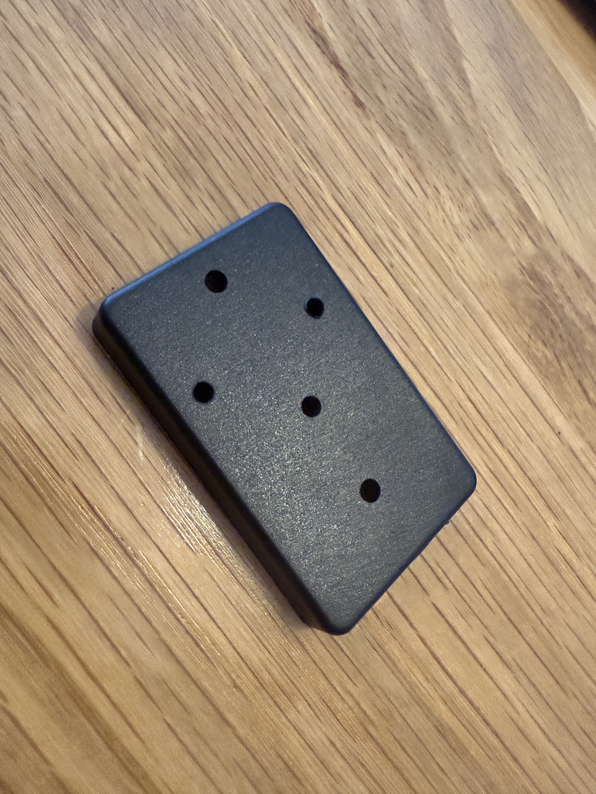
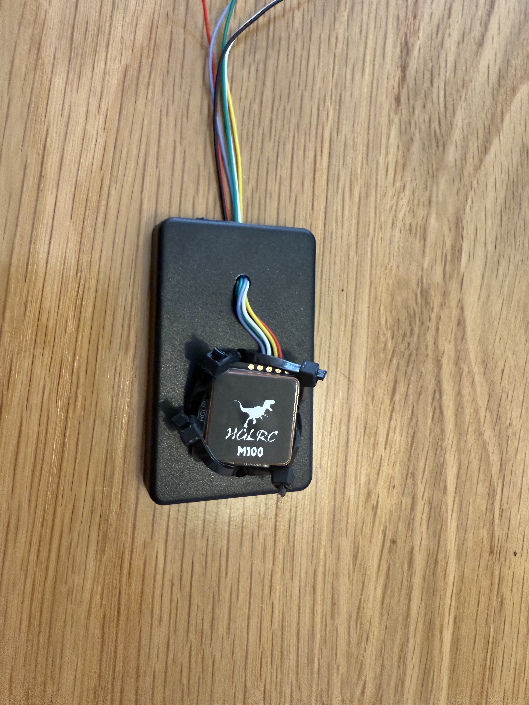
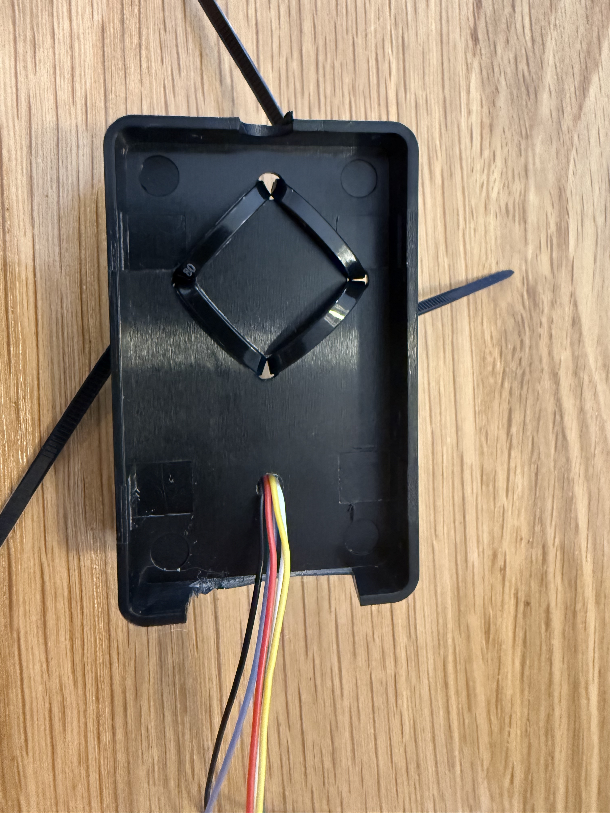
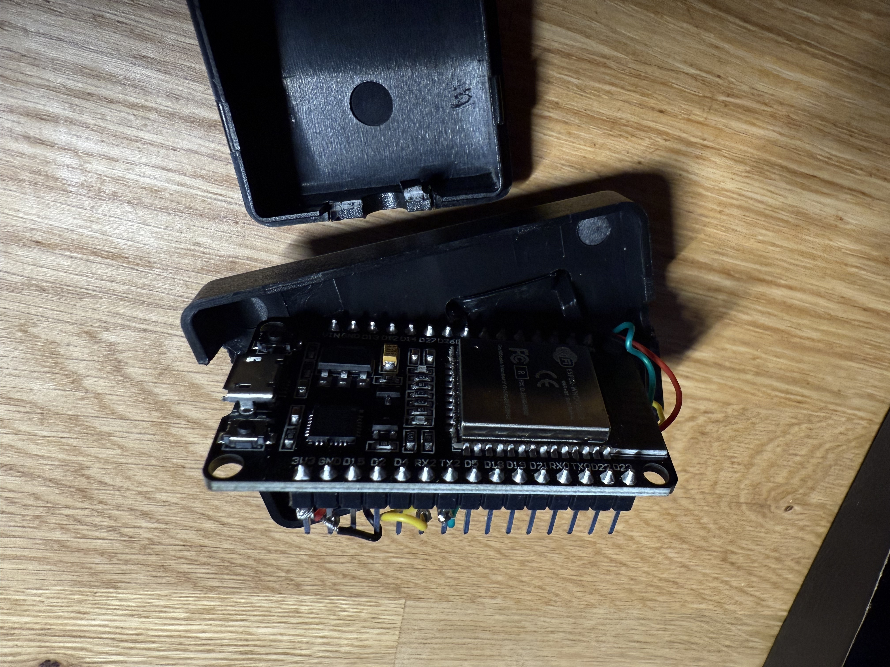
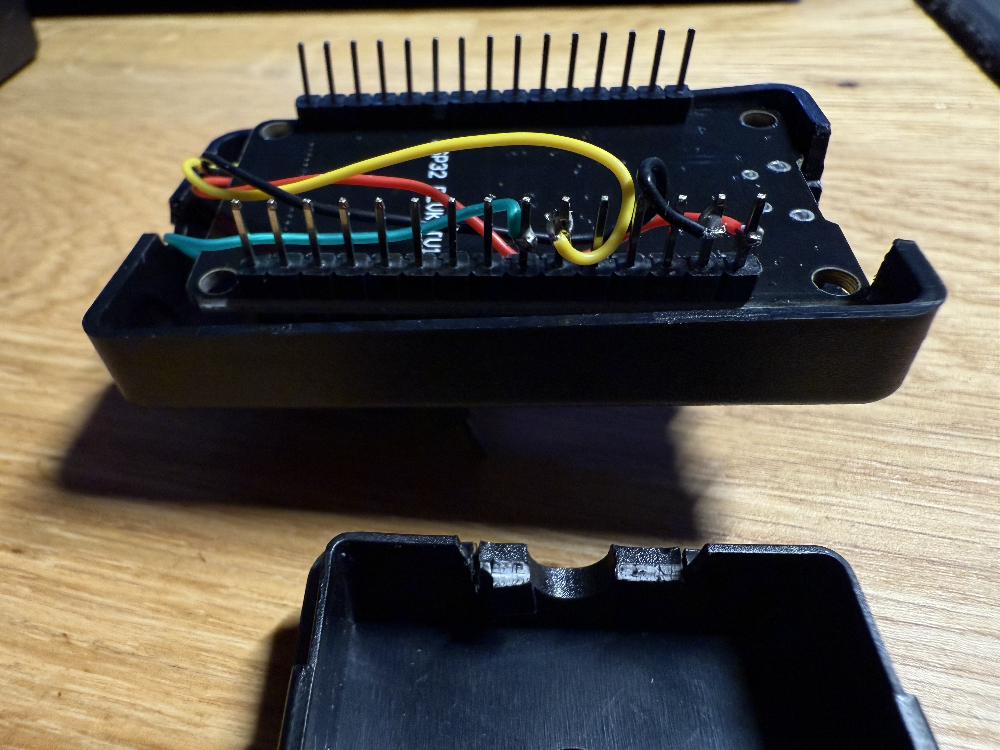
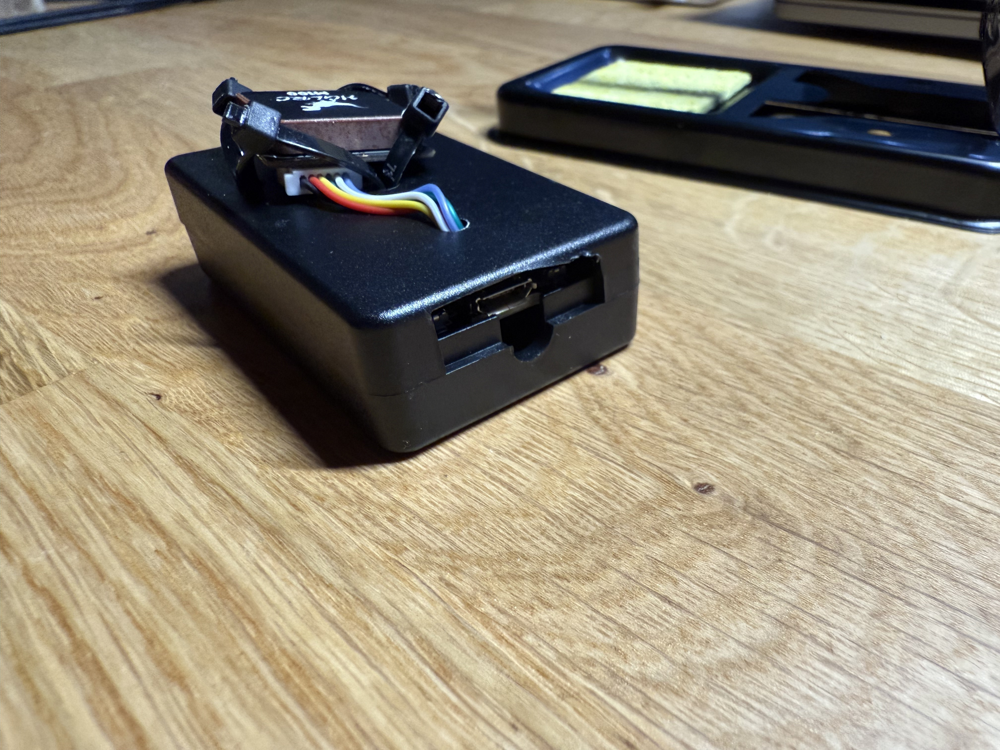
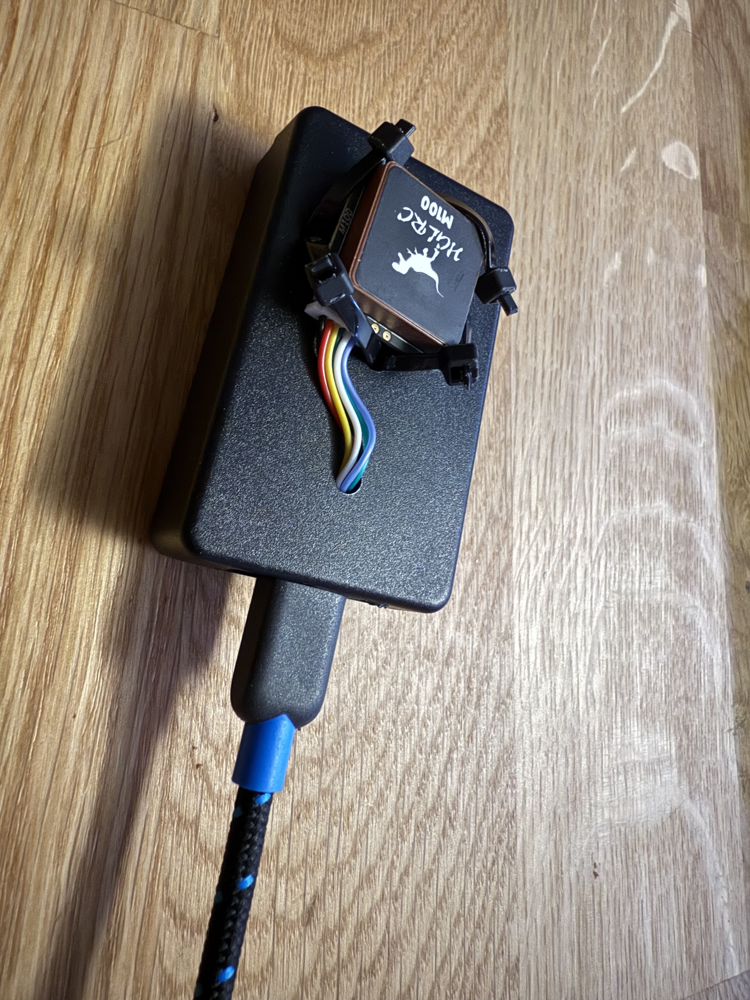

# Opensource 10+hz GPS for Autocross Datalogger

External GPS devices for motorsports can be a little pricey so this opensource DIY device is a great alternative for someone trying to save some money. I'm having a hard time finding good external devices to use with the  Autocross Datalogger iOS app that I'm developing so the next best option is allow others to build their own if they are so inclined. 

## Parts Used 

Below I'll list the parts that I've currently tested to work with this system. More to come as I try others! 

* [10hz GPS module](https://www.amazon.com/dp/B0CB5N8RQ8?ref=ppx_yo2ov_dt_b_fed_asin_title) The dinosaur is cool and the GPS traces are smooth at 10hz
* [ESP32-Wroom Development Board](https://www.amazon.com/dp/B08D5ZD528?ref=ppx_yo2ov_dt_b_fed_asin_title&th=1) I bought a 3 pack for development but you can find a single board for even cheaper. 

To power the board you have various options. The easiest and likely most readily available method is to connect it via micro USB to either a USB port on your car or a external battery pack. Or buy a 3.7v battery like [this](https://www.adafruit.com/product/1781) or [this](https://www.adafruit.com/product/1578) and wire the VIN and GND terminals. 

## Software Setup

* Setup Arduino IDE and the USB drivers for the ESP32. Great video [here](https://www.youtube.com/watch?v=CD8VJl27n94)
* Install TinyGPSPlus by Mikal Hart from the `Library Manager` tab in Arduino IDE on the left 
* Select the ESP32 in the `Tools/Board` menu and the appropriate USB to Serial port 
* Hit the `Upload` (right facing arrow) button after loading or copying and pasting the code in this repo
* The GPS device will start running everytime the ESP32 is powered on 

## Hardware Setup

You can solder the following together or purchase an [expansion board](https://www.amazon.com/dp/B0BYS6THLF/?coliid=I2RQV5BOV1V16A&colid=2QH3XV9NCWU4P&ref_=list_c_wl_lv_ov_lig_dp_it&th=1) and use the screw terminals.

* The GPS module gets powered by the 3v3 pin on the ESP32
* The GPS module ground wire goes to the GND terminal next to 3v3 on the ESP32
* The GPS module RX pin goes to the TX2 pin on the ESP32
* The GPS module TX pin goes to the RX2 pin on the ESP32
* If you are using a hardwired battery the hot wire from the battery goes to the VIN pin on the ESP32. And the other goes to the neighboring GND pin. 
* You'll have to come up with your own case or mounting methods

## Assembled

I assembled my prototypes with a [cheap junction box](https://www.amazon.com/dp/B07WMNQ22D?ref=ppx_yo2ov_dt_b_fed_asin_title&th=1) with dimensions 60x37x17mm and some small zip ties. 

1. Drill a few holes in the top for the zip ties and GPS cables. 

2. Attach the GPS device with zip ties and thread the cables through. 

3. Solder the GPS wires as described above. 

4. Assemble and make sure the micro USB cable can be attached

